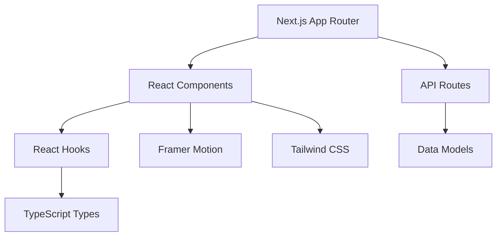

# AIAE 技术实现文档

## 1. 核心架构

### 1.1 应用架构
```
AIAE
├── 前端层 (Next.js App Router)
│   ├── 页面组件 (Pages)
│   ├── 布局组件 (Layouts)
│   └── API 路由 (API Routes)
├── 状态管理层 (React Hooks)
│   ├── 全局状态
│   └── 组件状态
└── 数据层
    ├── 类型定义
    └── 数据模型
```

### 1.2 技术依赖关系


## 2. 核心模块实现

### 2.1 项目库模块

#### 2.1.1 组件结构
```typescript
// 组件依赖关系
ProjectPage
├── ProjectCard
│   ├── ProjectStatus
│   ├── ProjectTags
│   └── ProjectActions
├── ProjectFilters
└── ProjectModal
    ├── ProjectDetails
    ├── ContactForm
    └── DiscussionArea
```

#### 2.1.2 关键函数实现
```typescript
// 项目筛选逻辑
const filterProjects = (projects: Project[], filters: ProjectFilters) => {
  return projects.filter(project => {
    // 阶段筛选
    if (filters.stage && project.stage !== filters.stage) return false;
    // 类型筛选
    if (filters.type && project.type !== filters.type) return false;
    // 团队状态筛选
    if (filters.teamStatus && project.teamStatus !== filters.teamStatus) return false;
    // 行业筛选
    if (filters.industry && project.industry !== filters.industry) return false;
    // 资源需求筛选
    if (filters.resourceNeeds?.length) {
      return filters.resourceNeeds.every(need => 
        project.resourceNeeds.includes(need)
      );
    }
    return true;
  });
};

// 项目卡片展开动画
const ProjectCardAnimation = {
  initial: { width: '100%' },
  expanded: { 
    width: '175%',
    transition: {
      duration: 0.5,
      ease: [0.4, 0, 0.2, 1]
    }
  }
};
```

### 2.2 人才库模块

#### 2.2.1 组件结构
```typescript
// 组件依赖关系
TalentPage
├── TalentCard
│   ├── TalentInfo
│   ├── SkillTags
│   └── ContactInfo
├── TalentFilters
└── TalentModal
    ├── TalentDetails
    └── ProjectHistory
```

#### 2.2.2 关键函数实现
```typescript
// 人才筛选逻辑
const filterTalents = (talents: Talent[], filters: TalentFilters) => {
  return talents.filter(talent => {
    // 技能筛选
    if (filters.skills?.length) {
      return filters.skills.every(skill => 
        talent.skills.includes(skill)
      );
    }
    // 角色筛选
    if (filters.role && talent.role !== filters.role) return false;
    // 教育背景筛选
    if (filters.education && talent.education !== filters.education) return false;
    // 可用性筛选
    if (filters.availability && talent.availability !== filters.availability) return false;
    // 地理位置筛选
    if (filters.location && talent.location !== filters.location) return false;
    return true;
  });
};
```

### 2.3 讨论区模块

#### 2.3.1 组件结构
```typescript
// 组件依赖关系
DiscussionPage
├── PostCard
│   ├── PostHeader
│   ├── PostContent
│   └── PostActions
├── PostForm
├── CommentDialog
└── PostFilters
```

#### 2.3.2 关键函数实现
```typescript
// 帖子排序逻辑
const sortPosts = (posts: Post[], sortBy: SortOption) => {
  switch (sortBy) {
    case 'latest':
      return [...posts].sort((a, b) => 
        new Date(b.date).getTime() - new Date(a.date).getTime()
      );
    case 'popular':
      return [...posts].sort((a, b) => b.likes - a.likes);
    case 'mostCommented':
      return [...posts].sort((a, b) => b.comments - a.comments);
    default:
      return posts;
  }
};

// 评论提交处理
const handleCommentSubmit = async (postId: number, content: string) => {
  try {
    const response = await fetch('/api/comments', {
      method: 'POST',
      headers: { 'Content-Type': 'application/json' },
      body: JSON.stringify({ postId, content })
    });
    
    if (!response.ok) throw new Error('评论提交失败');
    
    // 更新本地状态
    setPosts(posts.map(post =>
      post.id === postId
        ? { ...post, comments: post.comments + 1 }
        : post
    ));
  } catch (error) {
    console.error('评论提交错误:', error);
  }
};
```

## 3. 状态管理

### 3.1 全局状态
```typescript
// 用户状态
interface UserState {
  isAuthenticated: boolean;
  user: User | null;
  preferences: UserPreferences;
}

// 筛选状态
interface FilterState {
  projects: ProjectFilters;
  talents: TalentFilters;
  posts: PostFilters;
}
```

### 3.2 状态更新逻辑
```typescript
// 状态更新器
const updateFilters = (type: 'projects' | 'talents' | 'posts', filters: any) => {
  setFilterState(prev => ({
    ...prev,
    [type]: filters
  }));
};

// 状态持久化
useEffect(() => {
  const savedFilters = localStorage.getItem('filters');
  if (savedFilters) {
    setFilterState(JSON.parse(savedFilters));
  }
}, []);

useEffect(() => {
  localStorage.setItem('filters', JSON.stringify(filterState));
}, [filterState]);
```

## 4. API 实现

### 4.1 路由结构
```typescript
// API 路由
/api
├── projects
│   ├── GET /api/projects
│   ├── POST /api/projects
│   └── GET /api/projects/[id]
├── talents
│   ├── GET /api/talents
│   └── GET /api/talents/[id]
└── posts
    ├── GET /api/posts
    ├── POST /api/posts
    └── POST /api/posts/[id]/comments
```

### 4.2 API 处理函数
```typescript
// 项目 API 处理
export async function GET(request: Request) {
  const { searchParams } = new URL(request.url);
  const filters = Object.fromEntries(searchParams);
  
  try {
    const projects = await getProjects(filters);
    return NextResponse.json(projects);
  } catch (error) {
    return NextResponse.json(
      { error: '获取项目列表失败' },
      { status: 500 }
    );
  }
}

// 评论 API 处理
export async function POST(
  request: Request,
  { params }: { params: { id: string } }
) {
  try {
    const body = await request.json();
    const comment = await createComment(params.id, body);
    return NextResponse.json(comment);
  } catch (error) {
    return NextResponse.json(
      { error: '创建评论失败' },
      { status: 500 }
    );
  }
}
```

## 5. 性能优化实现

### 5.1 组件优化
```typescript
// 组件懒加载
const ProjectModal = dynamic(() => import('./ProjectModal'), {
  loading: () => <LoadingSpinner />,
  ssr: false
});

// 图片优化
const OptimizedImage = ({ src, alt }: ImageProps) => (
  <Image
    src={src}
    alt={alt}
    width={500}
    height={300}
    loading="lazy"
    placeholder="blur"
    blurDataURL="data:image/jpeg;base64,..."
  />
);
```

### 5.2 数据获取优化
```typescript
// 数据预取
export async function generateStaticParams() {
  const projects = await getProjects();
  return projects.map(project => ({
    id: project.id.toString()
  }));
}

// 增量静态再生成
export const revalidate = 3600; // 每小时重新生成
```

## 6. 安全实现

### 6.1 认证实现
```typescript
// JWT 验证中间件
export async function middleware(request: NextRequest) {
  const token = request.cookies.get('token');
  
  if (!token) {
    return NextResponse.redirect(new URL('/login', request.url));
  }
  
  try {
    const decoded = verify(token.value, JWT_SECRET);
    const requestHeaders = new Headers(request.headers);
    requestHeaders.set('user', JSON.stringify(decoded));
    
    return NextResponse.next({
      request: {
        headers: requestHeaders,
      },
    });
  } catch (error) {
    return NextResponse.redirect(new URL('/login', request.url));
  }
}
```

### 6.2 数据验证
```typescript
// 输入验证
const validateProject = (data: any): Project => {
  const schema = z.object({
    name: z.string().min(1),
    description: z.string().min(10),
    stage: z.enum(['idea', 'prototype', 'seed', 'competition', 'implemented', 'other']),
    type: z.enum(['research', 'startup', 'cooperation', 'innovation', 'competition']),
    // ... 其他字段验证
  });
  
  return schema.parse(data);
};
```

## 7. 部署配置

### 7.1 Vercel 配置
```json
{
  "version": 2,
  "builds": [
    {
      "src": "package.json",
      "use": "@vercel/next"
    }
  ],
  "env": {
    "JWT_SECRET": "@jwt-secret",
    "DATABASE_URL": "@database-url"
  }
}
```

### 7.2 环境变量配置
```typescript
// 环境变量类型定义
declare global {
  namespace NodeJS {
    interface ProcessEnv {
      NODE_ENV: 'development' | 'production' | 'test';
      JWT_SECRET: string;
      DATABASE_URL: string;
      NEXT_PUBLIC_API_URL: string;
    }
  }
}
```

## 8. 测试实现

### 8.1 组件测试
```typescript
// 项目卡片测试
describe('ProjectCard', () => {
  it('renders project information correctly', () => {
    const project = mockProject;
    render(<ProjectCard project={project} />);
    
    expect(screen.getByText(project.name)).toBeInTheDocument();
    expect(screen.getByText(project.description)).toBeInTheDocument();
  });
  
  it('expands when clicked', async () => {
    const project = mockProject;
    render(<ProjectCard project={project} />);
    
    const card = screen.getByTestId('project-card');
    await userEvent.click(card);
    
    expect(card).toHaveStyle({ width: '175%' });
  });
});
```

### 8.2 API 测试
```typescript
// API 路由测试
describe('Projects API', () => {
  it('returns filtered projects', async () => {
    const response = await fetch('/api/projects?stage=idea');
    const data = await response.json();
    
    expect(response.status).toBe(200);
    expect(data.every((p: Project) => p.stage === 'idea')).toBe(true);
  });
});
``` 